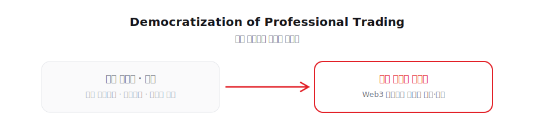

# 2. 비전 (Vision)

<figure><figcaption></figcaption></figure>

**"Democratization of Professional Trading" (전문 트레이딩 기술의 민주화)**

고성능 퀀트(Quant) 알고리즘, 실시간 데이터 분석 도구, 자동매매 엔진은 오랫동안 소수 전문가와 기관의 전유물처럼 여겨져 왔습니다. 레드힐은 이러한 전문 투자 기술을 일반 투자자도 보다 쉽게 접근하고 활용할 수 있도록 하는 것을 목표로 합니다.

레드힐의 비전은 단순한 투자 정보 제공이 아니라, 실제로 시장에서 작동하는 자동매매 기술과 분석 도구를 Web3 인증 구조와 결합하여, 누구나 **전문 트레이딩 기술의 혜택을 공유할 수 있는 환경**을 만드는 것입니다.
