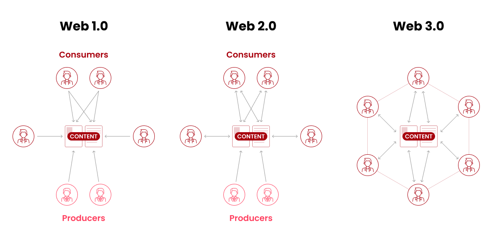
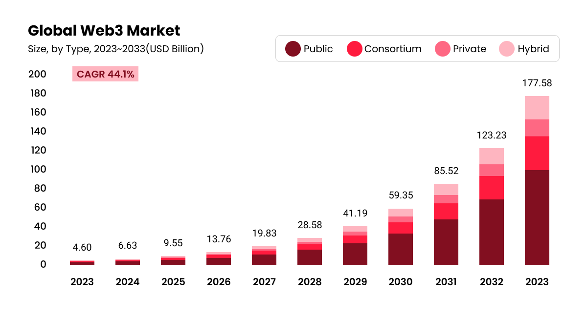

# 2️⃣ 사업 배경

### **탈중앙화 된 미래: 웹3와 디파이**

웹3는 참여자들이 데이터를 장악하는 중개자 없이 다양한 활동을 가능하게 하는 웹 서비스를 말한다. 웹3는 블록체인을 기반으로 하여 제공되는 서비스이므로 참여보상 시스템으로서의 DAO, 데이터베이스로서의 분산원장, 경제활동의 중심 요소가 되는 코인/토큰이 기본 구조를 이룬다. 웹3의 이러한 구조는 그 자체로 새로운 비즈니스 모델이 된다. 분산원장 데이터 베이스 및 코인/토큰을 사용하여 서비스 이용 시 원활하게 결제할 수 있게 하고, 참여자 간 거버넌스를 형성하도록 한다. 스마트 컨트랙트에 의한 자체 거래 시스템과 프로토콜에 따라 작동되는 생태계를 구성하게 되는 것이다.

웹3는 기존의 중앙 집중형 인터넷 환경과 달리 블록체인 기반의 분산형 네트워크를 지향한다. 현재 사용되고 있는 인터넷은 구글, 페이스북, 아마존 등 거대 IT 기업들이 데이터와 콘텐츠를 독점하고 있는 구조다. 하지만 웹3에서는 데이터와 콘텐츠가 특정 기업이나 플랫폼에 집중되지 않고 블록체인 네트워크 위에 분산 저장된다. 이를 통해 개방성과 중립성을 보장하며, 개인의 데이터 주권 또한 확보될 수 있게 하고, 정보의 조작과 검열이 어려워져 언론의 자유와 표현의 자유를 강화시킨다.

<figure><figcaption>
<strong>Figure02. Web 1.0 vs Web 2.0 vs Web 3.0</strong>
</figcaption></figure>

글로벌 웹3의 시장 규모는 2024년 66억 3천만 달러를 넘을 것으로 평가되고 있다. 2033년에는 1,775억 8천만 달러의 평가액을 달성할 것이며, 웹3 산업 점유율이 2024년부터 2033년까지 연평균 44.1%로 성장할 것으로 예상되고 있다. 이처럼 빠르게 확대되고 있는 웹3 시장에는 암호화폐, 대체 불가능 토큰(NFT), 탈중앙화 금융(DeFi) 애플리케이션, 디지털 자산을 통합한 탈중앙화 자율 조직(DAO), 메타버스 및 게임 플랫폼, 오라클, 토큰 표준, 계층 2 확장 솔루션 등과 같은 인프라를 포함한다.&#x20;

<figure><figcaption>
<strong>Figure03. Global Web3 Market Size(source:: market.us)</strong>
</figcaption></figure>

현재 가장 활성화된 대표적인 웹3 서비스는 디파이(DeFi)다. 디파이는 '탈중앙화 금융(Decentralized Finance, DeFi)'의 약자로, 중앙관리자와 중개자 없이 블록체인의 스마트 컨트랙트에서만 작동하는 금융 서비스를 말한다. 디파이는 스마트 컨트랙트를 통해 코인/토큰을 담보로 대출을 받거나 예치(Staking) 하여 이자를 받는 등 다양한 금융 서비스 분야에 활용되고 있다. 이와 같은 성과를 통해 디파이는 블록체인 및 분산원장기술(DLT)을 기반으로 하여 투명성과 효율성, 접근성을 향상시켜 미래 금융의 한 축으로 손꼽히고 있다.
