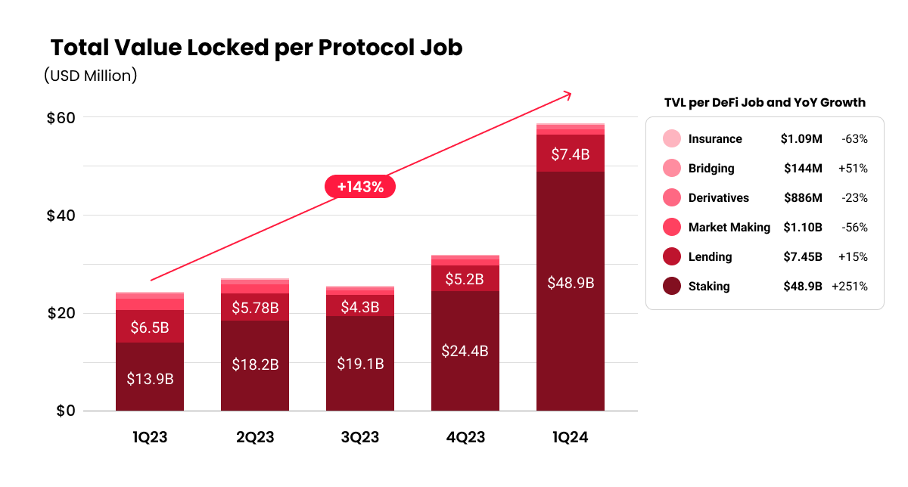
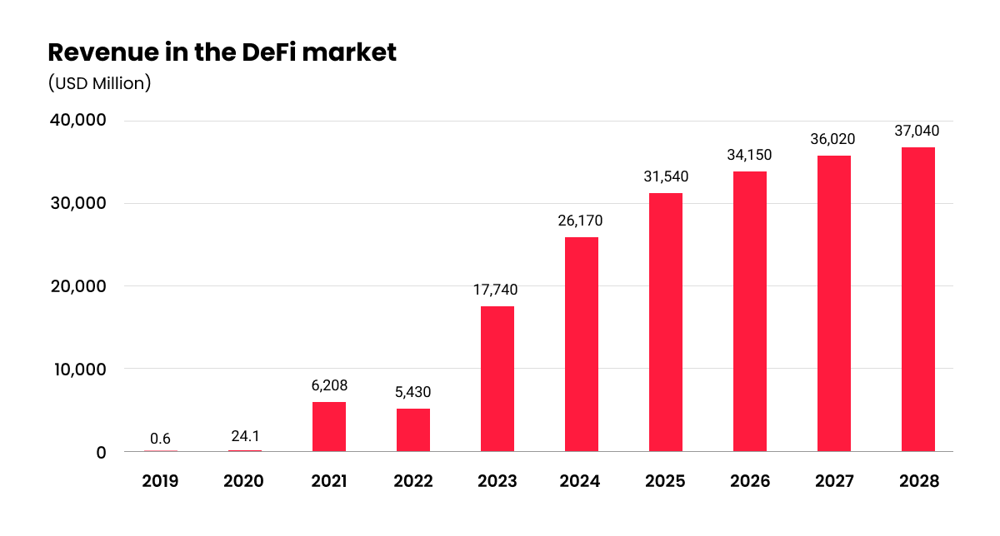

# 3️⃣ 시장 트렌드

### **디파이 시장의 성장과 전망**

디파이 분석 사이트 디파이라마(DefiLlama)가 발표한 자료에 따르면, 전 세계 디파이 프로젝트에 예치된 자금 규모는 900억 달러(약 120조 원)으로, 한달 전(620억 달러) 대비 45.1%, 1년 전(500억 달러) 대비 80% 증가한 수준으로 나타났다. 2022년 테라·루나 사태 이후 2년만에 디파이 총 예치 금액이 900억 달러를 넘긴 것이다. 이는 비트코인 ETF 승인 등으로 암호화폐가 제도권에 편입되면서 시장이 다시 활성화되고 있는 것으로 분석되고 있다.

투자 플랫폼 Exponential이 발표한 최근 보고서에 따르면, 수익률을 생성하는 디파이 프로토콜의 총 가치 잠금(Total Value Locked, TVL)은 2023년 3분기 265억 달러에서 2024년 1분기 597억 달러로 꾸준히 증가했으며, 이러한 성장은 디파이 시장에 대한 신뢰와 유동성의 복귀를 의미한다고 평가하고 있다.&#x20;

<figure><figcaption>
<strong>Figure04. Total Value Locked per Protocol Job(Source: Exponential.fi)</strong>
</figcaption></figure>

또한 비즈니스 데이터를 제공하는 스태티스타(Statista)데 따르면, 디파이 시장의 예상 매출액은 2024년까지 26,170.0만 달러이며, 예상 성장률(CAGR 2024\~2028년)을 9.07%로 평가할 때, 2028년까지 총 37,040만 달러가 될 것으로 예측하고 있다. 이러한 분석은 디파이 시장의 성장과 혁신적인 변화를 나타내고 있으며, 시장이 합리성, 효율성 및 위험 인식 제고를 향해 성숙해지고 있음을 시사하고 있다.&#x20;

<figure><figcaption>
<strong>Figure05. Revenue in the DeFi market(source: Statista Market Insights)</strong>
</figcaption></figure>

국경에 제한을 받지 않는 블록체인의 특성에 따라 디파이는 기업에게 새로운 시장 기회를 열어줌으로써 글로벌화가 가능하도록 이끌 것으로 기대를 모으고 있다. 스마트 컨트랙트의 자동화 기능을 통해 관리 오버헤드를 줄이고, 운영 효율성을 향상시킴으로써 공급망 관리 및 계약 실행과 같은 비즈니스 프로세스에 혁신을 일으키게 할 것으로 전망되고 있다.
