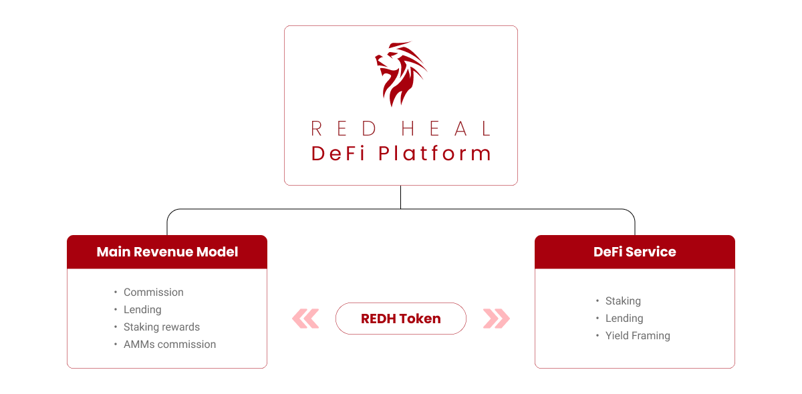
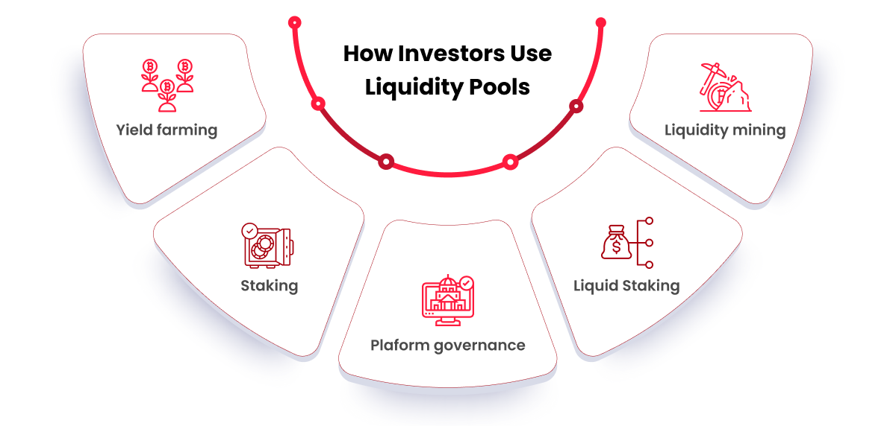
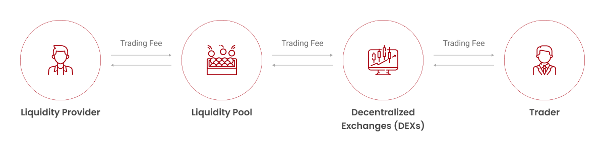
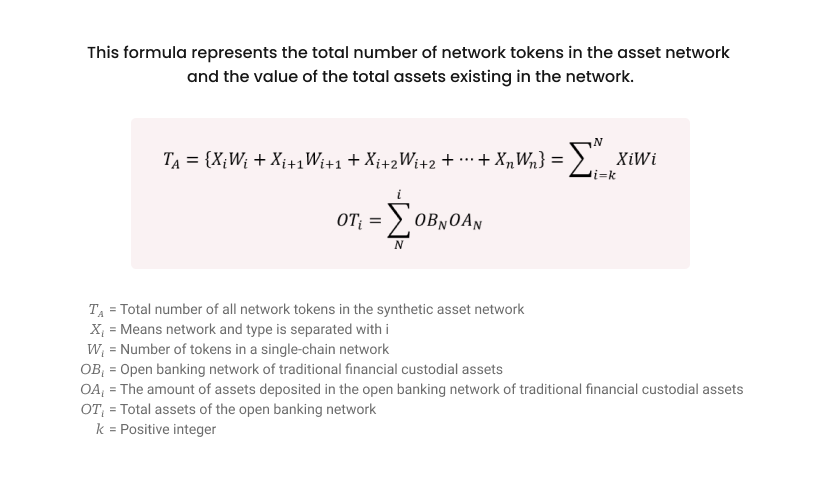
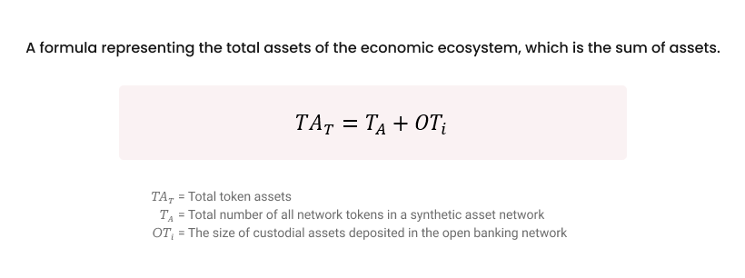
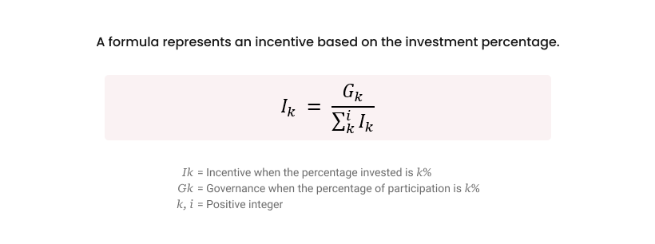
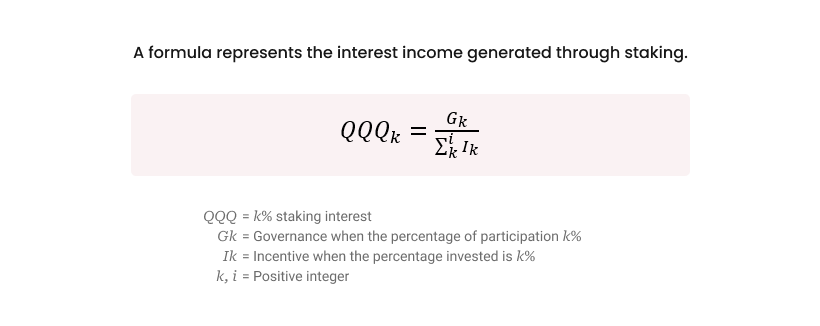
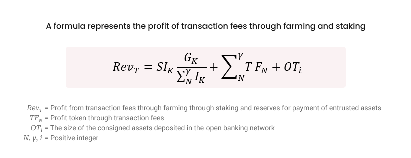

# 4️⃣ 사업 모델

REDHeal 프로젝트 팀은 REDHeal플랫폼을 기반으로 하는 디파이 서비스를 제공한다. 이를 위해 플랫폼 오픈 초기에는 예치(Staking and Swap)와 대출(Lending and Borrowing) 등 기본적인 디파이 서비스를 우선적으로 실행하여 유동성 풀(Liquidity Pools)을 안정적으로 조성하고, 디파이 서비스 플랫폼의 주요 수익인 대출 이자 및 수수료 수익을 창출하고자 한다. 또한 디파이 대출 서비스의 이자 및 수수료를 플랫폼의 거버넌스 토큰인 REDH토큰으로 지불하게 함으로써 REDH토큰의 활용도를 넓히고, 토큰 이코노미의 순환을 활성화시키며, 궁극적으로는 자산으로서 REDH토큰의 가치를 높여 시장에서의 입지를 확장시켜 나가는 것을 목표로 한다.

| ※ REDHeal플랫폼에서 제공되는 디파이 프로토콜의 주요 수익 모델은 다음과 같다.                                                                                                                                                  |
| ------------------------------------------------------------------------------------------------------------------------------------------------------------------------------------------------ |
| 
• 거래 수수료 - 디파이 서비스 거래를 처리하는 데 대한 수수료 부과

• 대출 이자 - 대출 기간에 따른 이자 수익 창출

• 스테이킹 보상 – 토큰을 스테이킹 하여 네트워크 보안에 기여한 데 대한 보상 지급

• 자동화 마켓 메이커(Automated Market Makers, AMMs) 거래 수수료
 |

| ※ REDHeal 디파이 프로토콜의 수익성을 분석하기 위해 다음과 같은 방법을 사용한다.                                                                                                                     |
| --------------------------------------------------------------------------------------------------------------------------------------------------------------------- |
| 
• 재무 모델링 - 프로토콜의 수익성을 예측하는 재무 모델 개발

• 현금 흐름 분석 - 프로젝트의 과거와 미래 현금 흐름 분석

• 시장 조사 - 목표 시장과 경쟁 환경에 대한 조사 실시

• 감사 - 신뢰할 수 있는 제3자가 프로토콜의 재무 상태를 검토
 |

<figure><figcaption>
<strong>Figure06. 비즈니스 모델 개요</strong>
</figcaption></figure>

**(1) 유동성 풀(Liquidity Pool)**

디파이 서비스를 제공하기 위해 필요한 것은 유동성을 안정적으로 확보하고 유지하는 것이다. 여기서 유동성이란, 쉽게 말해 어떤 코인/토큰을 다른 코인/토큰으로 쉽게 바꿀 수 있다는 것을 의미한다. 유동성은 암호화폐를 거래하는 시장에서 수요와 공급에 대한 거래 대기량을 줄여주고, 매수/매도를 원활하게 하는 역할을 한다. 모든 거래는 호가로 이루어지는데, 호가창(Order Book)이 비어있으면 매수자와 매도자의 적절한 가격대를 찾지 못하므로 이러한 문제(Slippage, 매매주문 시 발생하는 체결오차 현상)를 줄여주는 역할을 하는 것이 바로 유동성이다.&#x20;

<figure><figcaption>
<strong>Figure07. How Investors Use Liquidity Pools(source: Techopedia)</strong>
</figcaption></figure>

유동성 풀(Liquidity Pool)은 유저들이 자산을 DEX 또는 디파이 서비스 플랫폼의 스마트 컨트랙트에 모아 두어 암호화폐 간에 거래할 수 있는 자산 유동성을 제공하는 메커니즘이다. 쉽게 말하자면, '코인/토큰 간 거래를 하기 위해 코인/토큰들을 모아두는 곳'이라고 할 수 있다. 따라서 유성동 풀은 누구나 자신이 가지고 있는 코인/토큰과 다른 코인/토큰을 언제든지 교환할 수 있도록 다양하고 충분한 양의 암호화폐를 확보해 두어야 한다.&#x20;

<figure><figcaption>
<strong>Figure08. 유동성 풀의 작동 원리</strong>
</figcaption></figure>

유동성 풀에서 성사되는 모든 거래는 유동성 풀을 자동으로 관리하도록 프로그래밍되어 있는 스마트 컨트랙트에 의해 처리된다. 스마트 컨트랙트의 자동화된 시장 조성자(Automated Market Maker, AMM) 알고리즘은 각 코인/토큰의 가격을 결정하고 수요와 공급에 따라 실시간으로 가격을 조정한다. 이를 통해 유동성 풀 내 각 코인/토큰의 공급량은 항상 풀의 다른 코인/토큰에 비례하도록 보장한다. 스마트 컨트랙트는 유동성 풀의 현재 예비금을 기준으로 수학적 공식을 사용해 각 코인/토큰의 가격을 결정함으로써 모든 거래 당사자에게 공정하고 투명한 거래를 보장한다.&#x20;

<figure><figcaption>
<strong>Figure09. 네트워크에서 거래되는 토큰의 총합과 네트워크에 존재하는 총 자산의 값</strong>
</figcaption></figure>

<figure><figcaption>
<strong>Figure10. 이코노믹 생태계의 총 자산</strong>
</figcaption></figure>

**(2) 예치(Staking)**

스테이킹(Staking)이란, 자신의 보유한 암호화폐를 블록체인 네트워크에 예치한 뒤 해당 플랫폼의 운영 및 검증에 참여하고, 이에 대한 보상으로 해당 네트워크 토큰을 받는 것을 말한다. 유저는 REDHeal플랫폼을 통해 메인넷 코인(POL) 또는 메인넷과 호환이 가능한 네트워크에서 발행된 코인/토큰을 예치하고, 예치한 수량에 비례하여 플랫폼의 거버넌스 토큰(REDH)으로 이자 수익을 받게 된다. 이는 게임이론과 인센티브 구조를 활용해 자본을 투입하지 않고도 유동성이 공급되는 구조를 조성한다. 또한 예치한 코인/토큰의 가치가 하락하면 팔아서 리스크를 없애고, 가치가 상승하면 코인/토큰을 예치한 유저와 재단이 같이 더 큰 수익을 내는 ‘윈-윈 (win-win)’ 구조를 형성한다.&#x20;

<figure><figcaption>
<strong>Figure11. 투자 비율에 기초한 인센티브</strong>
</figcaption></figure>

<figure><figcaption>
<strong>Figure12. 스테이킹을 통해 창출되는 이자수익</strong>
</figcaption></figure>

<figure><figcaption>
<strong>Figure13. 파밍과 스테이킹을 통한 거래 수수료 수익</strong>
</figcaption></figure>

스테이킹은 기존 중앙 은행의 예금 시스템과 비슷한 개념이라고 볼 수 있다. 은행에 돈을 예금하면 은행이 정한 내부 기준에 따라 기간과 금액에 대한 특정 비율만큼 이자가 지급된다. REDHeal플랫폼의 디파이 서비스에서는 플랫폼이 은행의 역할을 하게 되고, 유저가 예치한 토큰이 예금이 되는 것이다. 유저 입장에서는 토큰을 예치시키는 것만으로 리스크 없이 이자수익을 창출할 수 있다는 장점이 있으며, 블록체인이 거래 데이터를 잘 처리하는지, 또는 블록을 원활하게 생성하고 있는지 확인하고 검증하는 역할도 수행하게 되는 것이다.

**(3) 대출(Lending)**

디파이 대출은 중앙화된 금융기관의 통제 없이 블록체인 상에 미리 설정된 스마트 컨트랙트에 따라 자동으로 이루지는 금융 서비스를 의미한다. 디파이 대출은 스마트 컨트랙트가 자동으로 실행되는 블록체인 기술을 사용하기 때문에 투명성과 안전성이 보장된다. 유저는 자신의 코인/토큰을 담보로 제공하고, 이를 바탕으로 다른 코인/토큰을 대출받을 수 있다. 대출을 받은 후에는 일정한 이자율이 적용되며, 이자율은 자산의 수요와 공급에 따라 변동된다.&#x20;

REDHeal플랫폼은 디파이 대출 서비스의 실행을 위해 스마트 컨트랙트에 기록된 계약 내용을 결정하며, 유동성 풀을 통해 차입자(대출을 받고자 하는 사람)와 대여자(예치자)를 연결한다. 디파이 대출 서비스를 통해 차입자는 자신이 원하는 코인/토큰을 대출받고 기간과 수량에 따라 적용되는 이자를 지불하며, 대여자는 자신의 코인/토큰을 예치하여 대출을 위한 유동성 풀을 조성하는 데 기여한 대가로 이자 수익을 얻게 된다.&#x20;

현행 은행은 대출 과정에서 차입자의 신용도를 심사하고, 신용정보로 심사가 어려운 담보를 통한 신용 보강 과정을 통해 정보 비대칭성을 완화하여 대여자와 차입자 사이의 이익을 조정한다. 반면, 디파이 서비스에서 실행되는 코인/토큰 담보 대출은 익명성을 갖기 때문에 신용심사 절차가 필요없다. 즉 디파이 대출 프로토콜을 통해 중앙화된 중개자 없이 대여자와 차입자를 모집할 수 있다는 것이다. 또한 스마트 컨트랙트를 구동할 계정(지갑)만 가지고 있다면 익명성을 유지할 수 있기 때문에 코인/토큰을 담보로 하는 대출이 가능하게 되는 것이다.
