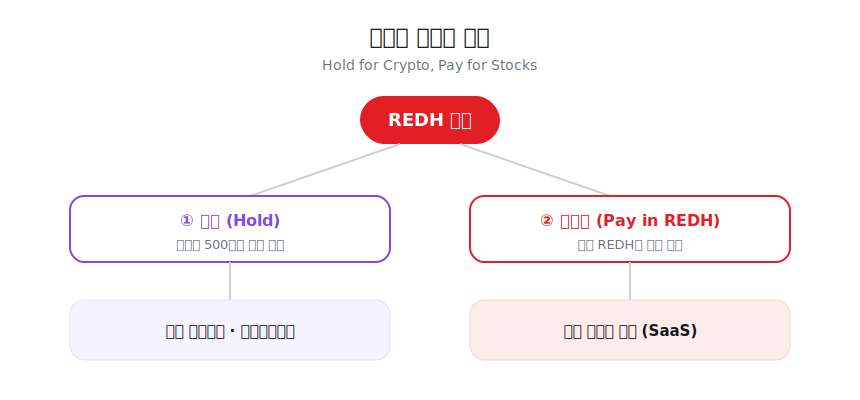

# 4. 비즈니스 모델 (Two-Track Business Model)

**"Hold for Crypto, Pay for Stocks."**

레드힐 프로젝트는 단일한 수익 구조에 의존하지 않고, 다음의 **투트랙 모델(Two-Track Model)**로 운영됩니다.

## Track 1. 보유형 멤버십 (Holding-Based Membership)

사용자가 본인 지갑에 일정 기준 이상의 REDH를 보유하면, **코인 자동매매 및 카피트레이딩 관련 서비스**를 추가 월 이용료 없이 이용할 수 있습니다.

* 기준: 본인 지갑 내 **500만 원 상당(KRW Valuation)**의 REDH 토큰 보유
* 혜택: 코인 자동매매 / 카피트레이딩 / 관련 퀀트 서비스 접근권 부여
* 유지 조건: 기준 미달 시 서비스 권한 자동 회수
* 효과: 서비스 이용을 위한 자발적 장기 보유를 유도하여 매도 압력을 낮추고, 토큰에 실질적인 보유 수요를 형성

## Track 2. 월결제형 서비스 (Monthly Subscription in REDH)

주식 관련 서비스는 별도의 **월 구독형 모델**로 운영되며, 결제 수단으로 REDH가 사용됩니다.

* 대상 서비스: AI 기반 급등주 탐지 시스템, 주식 시황 분석, 실시간 알림, 리포트, 주식 자동매매 관련 기능 등
* 결제 방식: 월 단위 REDH 결제
* 성격: 반복 매출형 SaaS 모델
* 효과: REDH에 지속적인 사용 수요를 부여하고, 주식 서비스 축에서 반복 매출을 창출

즉, 레드힐 생태계의 최종 구조는 다음과 같습니다.

* **REDH 보유 = 코인 자동매매 서비스 이용권**
* **REDH 월결제 = 주식 관련 서비스 이용권**

이 구조는 토큰의 보유 수요와 사용 수요를 동시에 만들어내는 하이브리드 유틸리티 구조입니다.

<figure><figcaption></figcaption></figure>
