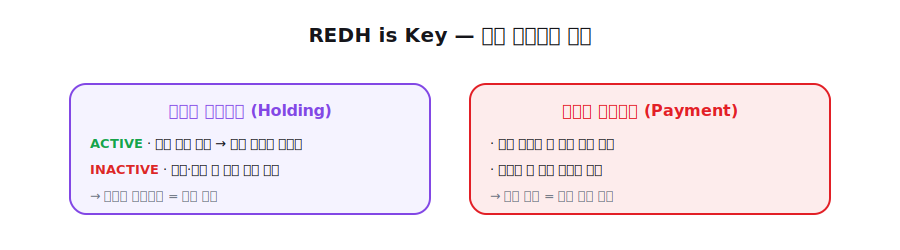

# 5. REDH 토큰 유틸리티 (Token Utility)

<figure><figcaption></figcaption></figure>

**"REDH is Key."**

REDH 토큰은 레드힐 생태계의 핵심 액세스 자산이며, 단순한 결제 토큰이 아닌 **실제 서비스 접근권과 반복 사용성을 동시에 가지는 멤버십 토큰**입니다.

## 5.1 보유형 유틸리티 (Holding Utility)

REDH를 일정 기준 이상 보유한 사용자는 **코인 자동매매 및 카피트레이딩 서비스**를 무료로 이용할 수 있습니다.

* **ACTIVE:** 기준 금액 이상 보유 시, 코인 자동매매 관련 프리미엄 서비스 활성화
* **INACTIVE:** 토큰 매도, 출금 또는 기준 미달 시 즉시 권한 회수

이 구조는 사용자가 서비스를 계속 이용하는 동안 자연스럽게 토큰을 보유하도록 유도하며, 결과적으로 강한 **락업 효과(Lock-up Effect)**를 발생시킵니다.

## 5.2 결제형 유틸리티 (Payment Utility)

REDH는 주식 관련 서비스의 월 구독료 결제 수단으로도 사용됩니다.

* 주식 서비스 접근을 위한 월 구독 결제
* REDH 기반 결제를 통한 생태계 내 순환 사용성 확보
* 반복 결제를 통한 지속적인 수요 창출

따라서 REDH는 단일한 기능만 가진 토큰이 아니라, **보유형 멤버십 키이자 서비스 결제 수단인 복합 유틸리티 토큰**입니다.
