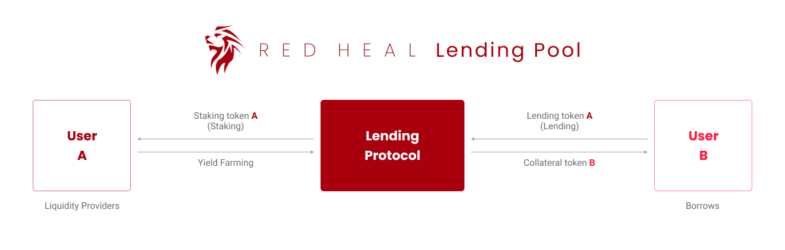
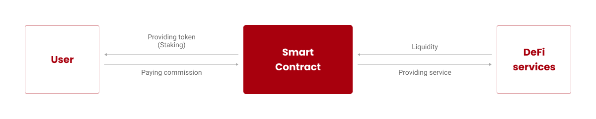
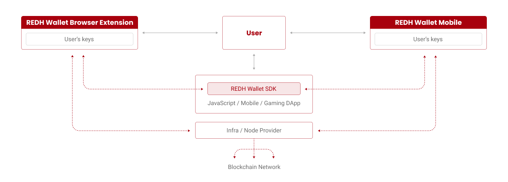
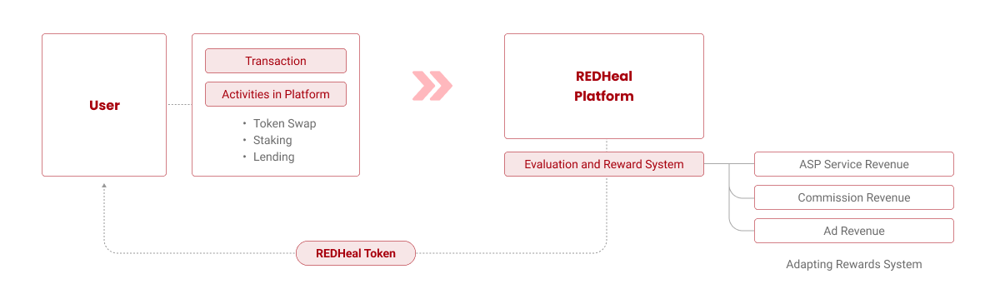
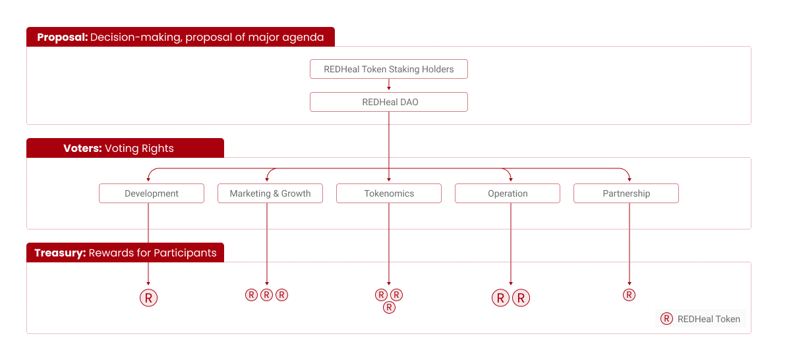

# 5️⃣ 플랫폼 생태계

REDHeal플랫폼은 Polygon을 기반으로 구축된 블록체인 기반의 디파이 서비스 플랫폼이다. REDHeal플랫폼에서는 코인/토큰 담보 대출, 예치(Staking) 등 다양한 디파이 서비스를 제공할 예정이다. REDHeal플랫폼의 유저는 코인/토큰을 예치함으로써 유동성 확보에 기여하는 유동성 제공자(Liquidity Providers)가 되거나 자신이 보유한 코인/토큰을 담보로 대출을 받는 채무자(Borrower)가 된다.&#x20;

REDHeal플랫폼의 거버넌스 토큰 REDH Token(REDH, 이하 REDH토큰)은 폴리곤 PoS 체인의 토큰 표준 ERC-20 을 기반으로 하여 발행된다. REDH토큰은 플랫폼 내 서비스를 이용하는 유저에게 보상으로 지급하는 수단이 되며, 유저가 플랫폼 내 디파이 서비스를 이용할 때 지불해야 하는 수수료를 결제하는 수단으로 활용할 수 있다.&#x20;

REDHeal 프로젝트는 추후 플랫폼과 서비스의 고도화와 안정화 단계를 거쳐, REDH토큰을 매개로 하는 확장된 디파이 생태계를 조성해 나갈 예정이다. 또한 유저의 편의성과 접근성을 높이기 위해 플랫폼 전용 개인 지갑(Multi-Signature Wallet)을 우선적으로 자체 개발하여 제공하며, 유저의 접근성과 편의성이 높은 모바일 전용 DApp, NFT 마켓 플레이스 등을 순차적으로 개발하여 보다 다양하고 확장된 분야로 서비스를 영역을 확대시켜 나갈 계획이다.&#x20;

<figure><figcaption>
<strong>Figure14. REDHeal플랫폼 생태계 개요</strong>
</figcaption></figure>

## 1. 서비스

REDHeal플랫폼의 디파이 서비스에서 유저는 자신의 코인/토큰을 디파이 프로토콜에 예치하여 이자 수익을 받거나 예치한 코인을 담보로 다른 코인/토큰을 대출하거나 유동성을 제공하고 이자 수익을 얻는(Yield Farming) 등 다양한 서비스를 이용할 수 있다.

### **(1) 예치(Staking & Swap)**

REDHeal플랫폼에서 제공하는 디파이 서비스 중 스테이킹은 REDH토큰을 얻을 수 있는 다양한 방법 중 하나이다. REDH토큰은 상장된 외부 거래소를 통해 유저가 직접 구매할 수 있으며, REDHeal플랫폼에 유동성을 제공하고 이자 수익 및 수수료 수익 등의 형태로 획득할 수 있다. 스테이킹은 안정적으로 자산을 확보할 수 있다는 점에서 많은 투자자가 선호하고 있는 투자 방식이다.

디파이에서 스테이킹은 자신이 보유하고 있는 암호화폐의 일정량을 지분(Stake)으로 고정하여 예치하는 것을 의미한다. 유저는 보유하고 있는 코인/토큰의 가격 등락과 상관없이 자신의 코인/토큰을 예치(지분을 보유)하는 것만으로 예치 기간 동안 일정 수준의 수익을 얻을 수 있다. 즉, 보유하고 있는 코인/토큰 지분의 유동성을 묶어두는(Lock-up) 대신 블록체인 플랫폼의 운영 및 검증에 참여하고, 이에 대한 보상으로 코인/토큰을 받게 되는 것이다. 디파이 스테이킹은 탈중앙화 금융 시스템에서 이자 수익을 창출하는 방법이며, 보상률은 코인/토큰마다 다르게 적용된다.

| ※ 서비스 운영 예시                                                                                                                                                                                                                                             |
| ------------------------------------------------------------------------------------------------------------------------------------------------------------------------------------------------------------------------------------------------------- |
| 
① Alice가 1BTC와 10 ETH를 유동성 풀에 예치합니다.

② Bob이 0.1 BTC를 ETH로 교환하고 싶어 합니다.

③ 스마트 컨트랙트가 유동성 풀의 예비금을 사용하여 가격을 계산합니다.

④ Bob은 ETH를 받고, 유동성 풀에는 약간 더 많은 BTC와 약간 더 적은 ETH가 남습니다.

⑤ Alice는 유동성 제공자로서 Bob의 거래에서 소액의 수수료(이자수익)를 받습니다.
 |

유저는 REDHeal플랫폼을 통해 메인넷 코인(POL)을 직접 예치하거나 Polygon과 호환이 가능한 네트워크에서 발행된 토큰을 예치(Staking)하여 유동성을 공급함으로써 디파이 서비스를 위한 유동성 풀이 조성되고, 안정적으로 유지될 수 있도록 한다. 이때, 토큰을 예치함으로써 유동성 풀을 조성하는 데 기여한 유저를 ‘유동성 제공자(Liquidity Providers)’라고 한다. 이들은 기여에 대한 대가로 거래 수수료와 토큰 인센티브 형태의 이자수익(Yield Farming)을 얻을 수 있다. 유동성 풀을 통해 유저는 코인/토큰 담보 대출 및 교환(Swap)등 다양한 디파이 서비스를 이용할 수 있다.

### **(2) 대출(Lending & Borrowing)**

유저는 REDHeal플랫폼을 통해 메인넷 코인(POL) 또는 메인넷과 호환이 가능한 네트워크에서 발행된 토큰을 담보로 하여 다른 코인/토큰을 빌릴 수 있다. 플랫폼의 디파이 대출 서비스를 통해 금융기관을 거치지 않고도 자신이 원하는 코인/토큰을 빌릴 수 있는 것이다. REDHeal플랫폼에서 제공되는 디파이 대출은 스마트 컨트랙트를 통해 자동으로 실행되며, 블록체인 기술을 사용하므로 투명하고 안전한 방식으로 진행되기 때문이다.


\
REDHeal플랫폼의 유저는 대출 거래 시 플랫폼의 거버넌스 토큰인 REDH토큰을 사용해 대출 거래 시 발행하는 거래 수수료, 대출 기간과 규모에 따라 발생하는 대출 이자를 지불할 수 있다. 이렇게 지불하게 된 REDH토큰은 스테이킹에 대한 이자수익으로 지급하게 되는 REDH토큰과 순환 구조를 이루어 플랫폼 생태계가 원활하게 작동되도록 한다. 이런 구조를 통해 REDH토큰이 원활하게 사용되고, 활성화되면 시장에서 형성되는 토큰의 가치를 상승시키시는 결과를 가져오게 되는 것이다.

<figure><figcaption>
<strong>Figure15. 디파이 대출 프로토콜</strong>
</figcaption></figure>

### **(3) 이자 농사(Yield Farming)**

REDHeal플랫폼은 스테이킹에 대한 보상으로 REDH토큰을 지급할 예정이다. REDHeal플랫폼의 디파이 생태계 내에서는 누구나 유동성 공급자가 될 수 있으며, 유동성을 공급한 유저에겐 그에 대한 보상으로 스테이킹 이자 수익이 지급된다. REDHeal플랫폼 서비스의 디파이 이자 농사는 코인/토큰 보유자가 자산을 활용하여 수익을 창출할 수 있는 방법 중 하나이다. 일반적으로 이자 농사를 통한 수익 보상은 거래 수수료나 대출 자금의 이자 형태로 지급되며, 지급 수단으로 플랫폼의 거버넌스 토큰인 REDH토큰을 사용한다.&#x20;

<figure><figcaption>
<strong>Figure16. 디파이 이자 농사(Yield Farming)</strong>
</figcaption></figure>

이자 농사의 주요 메커니즘은 다음과 같다.

**• 유동성 제공**

사용자는 유동성 풀에 자산을 제공하여 DEX(탈중앙화 거래소)나 대출 서비스 거래를 촉진하는 역할을 하며, 그 대가로 거래 수수료나 이자의 일부를 REDH토큰으로 지급받는다.

**• 스테이킹**

보유하고 있는 코인/토큰을 유동성 풀에 예치하고자 하는 유저는 Polygon 네트워크나 REDH디파이 플랫폼의 기능과 보안을 지원하기 위해 토큰을 잠그고(Lock up), 그에 대한 대가로 REDH토큰을 보상으로 지급받는다.

### **(4) 플랫폼 전용 지갑(Multi-Signature Wallet) 서비스**

REDHeal플랫폼의 서비스 초기에는 메인넷 Polygon네트워크에서 사용할 수 있는 외부 지갑과 연동하는 서비스를 제공할 예정이다. 추후 REDHeal플랫폼 전용 개인 지갑 ‘Multi-Signature Wallet’을 자체 개발하여 서비스 함으로써 유저의 사용 편의성을 제고하고, 디파이 서비스에 대한 진입 장벽을 낮추고자 한다.

REDHeal플랫폼의 전용 지갑은 플랫폼 토큰 REDH, Polygon 네트워크 기반의 토큰들을 관리하고 사용할 수 있는 브라우저 확장 프로그램이다. 이 지갑은 컴퓨터나 모바일 기기에 설치되는 소프트웨어로 사용자의 개인키를 저장한 후 코인/토큰 거래를 할 수 있다.

유저는 이 지갑을 사용하여 Polygon 블록체인 상에 배포된 스마트 컨트랙트와 상호 작용할 수 있다. 이를 통해 유저는 스마트 컨트랙트를 실행하고 데이터를 읽거나 쓸 수 있으며, 트랜잭션을 보낼 수 있다. 이 지갑에 보관 중인 코인/토큰을 다른 지갑 주소로 전송할 때는 해당 지갑의 주소를 입력하고, 보내고자 하는 토큰의 양을 지정하여 전송할 수 있다.

이 지갑은 기본적으로 REDH토큰, Polygon 네트워크 기반의 토큰을 안전하게 보관 및 전송하고 관리할 수 있으며, 스테이킹, 코인/토큰 담보 대출 등 REDHeal플랫폼의 디파이 서비스뿐만 아니라 NFT 거래에도 사용할 수 있도록 사용 범위를 순차적으로 확장시켜 나갈 예정이다.&#x20;

<figure><figcaption>
<strong>Figure17. 자체 개발하여 REDHeal플랫폼에 제공될 예정인 지갑서비스 구조 예시</strong>
</figcaption></figure>

## 2. 리워드 시스템

REDHeal플랫폼의 유저는 플랫폼에서 제공하는 디파이 서비스 이용 시 발생하는 이자수익에 대해 재단에서 정한 일정 비율에 따라 REDH토큰을 보상으로 지급받는다. 보상으로 획득한 REDH토큰은 플랫폼이 제공하는 디파이 서비스 이용 시 지불해야 하는 대출 및 거래 수수료나 이자 수수료를 지불/결제하는 수단으로 사용할 수 있으며, 다른 코인과 교환하여 가상자산 거래에 활용할 수 있다. 또한 토큰을 보유(Holding)함으로써 DAO에 참여할 수 있는 권한을 얻을 수도 있고, 플랫폼에 형성되는 유동성 풀에 예치함으로써 추가적으로 이자수익을 창출할 수도 있다.&#x20;

<figure><figcaption>
<strong>Figure18. Platform Ecosystem Reward System</strong>
</figcaption></figure>

## 3. DAO(탈중앙화된 자율 조직)

웹 3.0이 부상하며 블록체인 기반의 자율 조직 DAO가 주목 받고 있다. DAO는 특정 주체가 책임지는 것이 아니기에 대표할 수 없고(탈중앙화, Decentralized), 별도의 명령이나 관리가 필요 없는(자율, Autonomous) 조직(Organization)이다. 즉, 별도의 중앙화된 관리 주체의 위계나 서열이 없이 스마트 컨트랙트를 통해 구성원 모두가 자율적으로 공동의 의사결정에 참여해 목표 달성을 추구하는 조직이다. DAO는 스마트 컨트랙트를 사용하여 작성자가 정의한 규칙을 실행함으로써 자율적으로 실행되기 때문에 구성원들은 서로 누구인지 모르고(알 필요도 없으며), 의사결정을 위한 중앙 조직이 없음에도 공동의 목표를 향하여 집단적인 의사결정이 가능하다.

REDH 생태계 역시 주요 의사결정 기구인 REDHeal DAO를 통해 생태계 내 주요 아젠다를 제안하고, 수정하고, 결정하는 방식으로 운영된다. 스마트 컨트랙트와 투표로 운영되는 DAO를 통해 자금모집, 이익배분, 커뮤니티 구성원의 투표 등을 진행하기 위해서는 거버넌스 토큰인 REDH토큰이 필요하다. DAO 구성원들은 거버넌스 토큰의 보유 수량에 비례하여 투표권을 부여 받아 DAO의 의사결정 과정에 참여할 수 있으며, 상정된 아젠다에 대해 찬반 투표를 할 수 있다. 또한 DAO가 모집한 자금 사용 방향성과 DAO의 사업 방향성을 직접 제안할 수도 있으며, 기여도에 비례하여 DAO 활동에 따른 이익을 REDH토큰을 다시 배분 받을 수도 있다.

스마트 컨트랙트로 만들어진 DAO의 규칙은 DAO 구성원이라면 누구나 열람할 수 있지만(투명성), 아무나 쉽게 바꾸거나 삭제할 수는 없다. 단지 거버넌스 토큰을 가진 구성원들의 투표를 통해서만 DAO의 규칙을 결정하고 변경할 수 있다. 즉 기술적으로 공정성이 담보되는 것이다. 또한 모든 것이 블록체인상에 기록되어 결정 과정과 운영에 대한 투명성도 확보된다. 따라서 DAO는 개개인의 참여를 더욱 활성화시키고, 나아가 중앙조직 없이 구성원 모두가 생태계를 지탱할 수 있는 기술적 토대를 구축하기 위해 중요한 요소가 된다.

DAO는 대표 없이 운영되는 자율 조직이지만, DAO가 조달한 자금을 가지고 무엇을 할지에 대해서는 구성원의 투표(Voting)를 통해 결정한다. 이때 DAO는 구성원이 보유하고 있는 거버넌스 토큰의 비율에 따라 DAO가 내리는 주요 결정에 대한 투표권이 부여된다. 모든 거버넌스 토큰 보유자는 토큰을 보유하는 것만으로 규칙의 변경 사항을 제안할 수 있는 권한을 부여 받는다. 더 많은 토큰을 보유할수록 더 많은 투표권이 부여되므로 DAO에 보다 큰 영향력을 행사할 수 있게 되는 것이다.&#x20;

<figure><figcaption>
<strong>Figure19. REDHeal DAO의 구조</strong>
</figcaption></figure>
