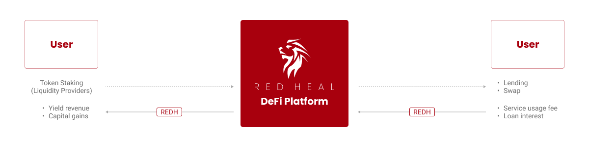

# 6️⃣ 토큰 이코노미

REDHeal플랫폼의 생태계는 Polygon 블록체인 네트워크에서 정한 표준 토큰 스펙 ERC-20 표준을 기반으로 발행한 REDHeal Token(이하 REDH)을 매개체로 하는 토큰 이코노미를 형성한다. REDH토큰은 상장된 거래소를 통해 직접 구매하거나 플랫폼에서 지급하는 보상으로 획득할 수 있다. 획득한 REDH토큰은 거래소를 통해 현금으로 변환하여 출금하거나 POL 네트워크의 지갑서비스를 통해 다른 코인/토큰으로 환전하여 투자자산으로 활용할 수 있다.

REDH토큰은 플랫폼 생태계를 조성하고 유지 및 활성화시키는 데 필요한 주요 요소이다. REDH토큰은 플랫폼의 디파이 서비스를 이용하는 유저에 대한 보상지급 수단, 디파이 서비스 거래 시 발생하는 수수료의 지급/결제수단으로 사용된다. 또한 REDH 생태계 내 주요 의사결정 기구인 DAO의 참여 자격 및 투표권 부여의 기준이 되는 거버넌스 토큰의 역할도 하게 된다.

REDH토큰은 플랫폼 생태계의 유저와 자산, 유저와 유저를 연결하여 ‘획득(지급)-사용(지불)’ 과정이 선순환 구조를 이루어 생태계를 유지시키고 지속시키는 역할을 한다. 또한 서비스의 진입 장벽을 낮춰 해외 유저의 유입량을 늘리고, 그로 인해 REDHeal플랫폼의 비즈니스 영역과 서비스 규모가 글로벌 시장으로 확장되는 데 있어 필수적이고 중요한 연결고리(Link) 역할을 하게 될 것이다.&#x20;

<figure><figcaption>
<strong>Figure20. REDHeal플랫폼 생태계의 토큰 이코노미</strong>
</figcaption></figure>

