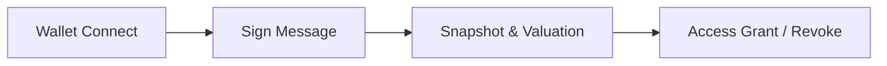

# 6. 기술적 인증 구조 (Technical Verification)

레드힐 플랫폼은 On-chain 데이터를 기반으로 사용자의 보유 상태와 서비스 자격을 실시간으로 검증하여 투명한 멤버십 생태계를 유지합니다.

## 6.1 보유형 멤버십 인증 흐름

1. **Wallet Connect** — 사용자는 개인 지갑(Metamask 등)을 레드힐 플랫폼에 연결합니다.
2. **Sign Message** — 전자서명을 통해 지갑 소유권 및 무결성을 검증합니다.
3. **Snapshot & Valuation** — 실시간 블록체인 스냅샷을 통해 REDH 보유량을 조회하고, 이를 원화 가치 기준으로 환산합니다.
4. **Access Grant / Revoke** — 기준 충족 시 코인 자동매매 서비스 접근 권한을 즉시 활성화하고, 기준 미달 시 자동 비활성화합니다.

## 6.2 월결제형 서비스 인증 흐름

1. 사용자는 주식 서비스 이용을 위해 REDH로 월 구독 결제를 진행합니다.
2. 플랫폼은 결제 내역과 유효기간을 검증합니다.
3. 결제 상태가 유효한 동안 주식 관련 서비스 접근 권한을 활성화합니다.
4. 구독 기간 만료 시 서비스 권한은 자동 비활성화됩니다.

이러한 구조를 통해 레드힐은 **지갑 보유 기반 권한 부여**와 **월 결제 기반 권한 부여**를 동시에 관리할 수 있는 하이브리드 인증 체계를 구현합니다.

