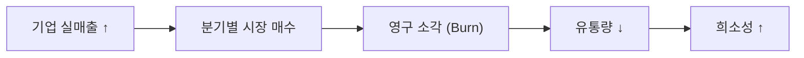

# 7. 토크노믹스 (Tokenomics)

**"Real-Revenue Buyback & Burn" (실매출 기반 바이백 & 소각)**

REDH는 단순한 기대감이나 투기성 내러티브에 의존하지 않고, **기업의 실질 매출과 순수익이 토큰 가치로 환원되는 디플레이션 모델**을 지향합니다.

## 7.1 재원 (Funding Sources)

REDH 생태계의 바이백 및 운영 재원은 다음과 같은 실제 수익원에서 발생합니다.

* 자동매매 프로그램 레퍼럴 수익
* 코인 자동매매 및 관련 서비스 수익
* 주식 관련 월 구독 서비스 수익
* 토큰 세일즈 수익
* 기타 기업 순수익

## 7.2 바이백 및 소각 (Buyback & Burn)

레드힐은 분기별(Quarterly)로 시장에서 REDH를 직접 매수하여 영구 소각하는 정책을 지향합니다.

* 분기 단위 시장 매수
* 영구 소각(Burn)
* 유통량 감소를 통한 디플레이션 효과 유도

## 7.3 기대 효과

* 기업 성장 → 실질 수익 증가
* 실질 수익 증가 → REDH 바이백 재원 확대
* 바이백 확대 → 유통량 감소
* 유통량 감소 → 토큰 희소성 강화

이 구조를 통해 REDH는 단순한 유틸리티 토큰을 넘어, **실서비스와 실매출이 뒷받침하는 가치 연동형 토큰 모델**로 작동합니다.

