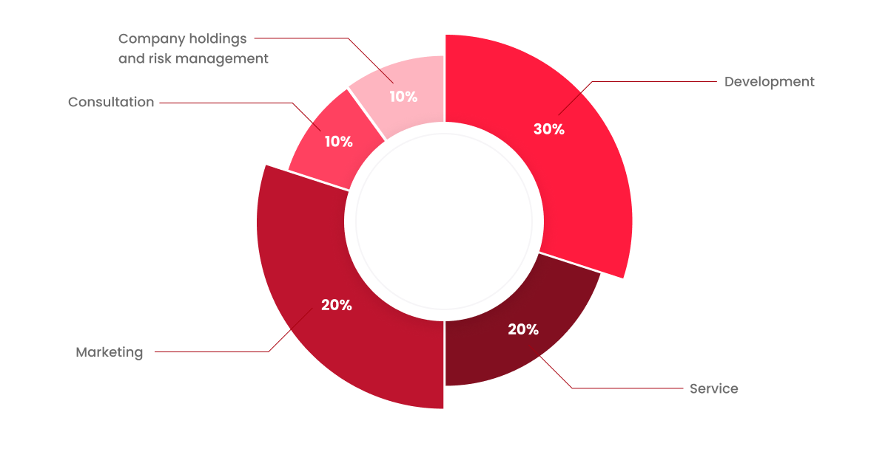

# 7️⃣ 토큰 플랜

REDH토큰은 거래의 안정성과 확장성을 고려하여 Polygon 네트워크에서 정한 표준 토큰 스펙 ERC-20 표준을 사용해 발행한다. ERC-20 토큰표준은 Polygon 네트워크 상에서 유통할 수 있는 토큰의 호환성을 보장하기 위한 표준 사양이다. ERC-20 토큰표준은 Polygon 네트워크를 이용하는 디앱(DApp)이 발행하는 토큰과 Polygon 네트워크의 호환성을 충족시키기 위해서 규정하고 있는 프로그래밍 기준이기 때문에 Polygon 블록체인을 활용하는 토큰의 경우에는 모두 ERC-20 토큰표준 기준을 맞춰야 한다.&#x20;

REDH토큰의 발행 계획에 대한 기본 정보는 다음과 같다.&#x20;

<table><thead><tr><th width="344"></th><th></th></tr></thead><tbody><tr><td>Token Name</td><td>REDHeal Token</td></tr><tr><td>Token Symbol </td><td>REDH </td></tr><tr><td>Standard </td><td>ERC-20(Polygon Network) </td></tr><tr><td>Total Supply </td><td>1,500,000,000 REDH </td></tr></tbody></table>

### • 토큰 분배 계획

REDH토큰은 플랫폼 개발과 구현 및 시스템 고도화(25%), 생태계 조성과 플랫폼 유지(35%), 사업초기 시드 및 인력확보, 토큰 개발비를 위한 토큰 스왑(20%), 프로젝트 팀과 생태계에 기여하는 어드바이저(5%), 투자자와 파트너십(10%), 회사운영, 여비비(5%)로 분배할 계획이다.&#x20;

<figure><figcaption>
<strong>Figure22. Token Allocation</strong>
</figcaption></figure>

### • 자금 운용 계획

REDH토큰을 통해 조성된 자금은 연구 개발 인력 충원 및 운용, 서비스 및 비즈니스 모델 고도화, 디앱 개발 등을 위한 개발비용(30%), REDH생태계를 위한 서비스 인력, 관리 인력 등 충원과 사무실 운영 등을 위한 서비스 구축비용(20%), 온/오프라인 광고 집행을 위한 마케팅 비용(30%), REDH토큰이 거래될 수 있는 각 국가의 법안과 실상에 맞는 법적자문 및 회계자문 비용(10%), 그리고 회사보유 및 리스크 대비(10%) 등으로 운용될 계획이다.

<figure><figcaption>
<strong>Figure23. Funds Management Plan</strong>
</figcaption></figure>
