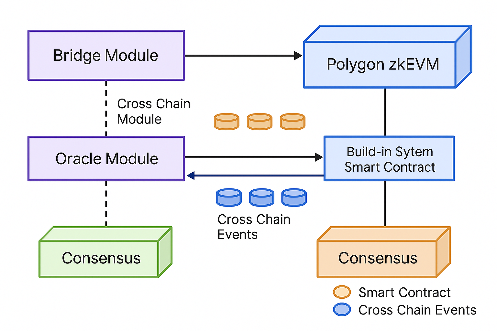
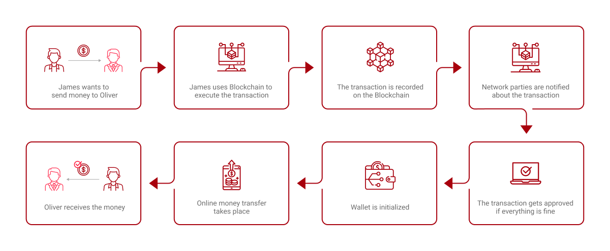
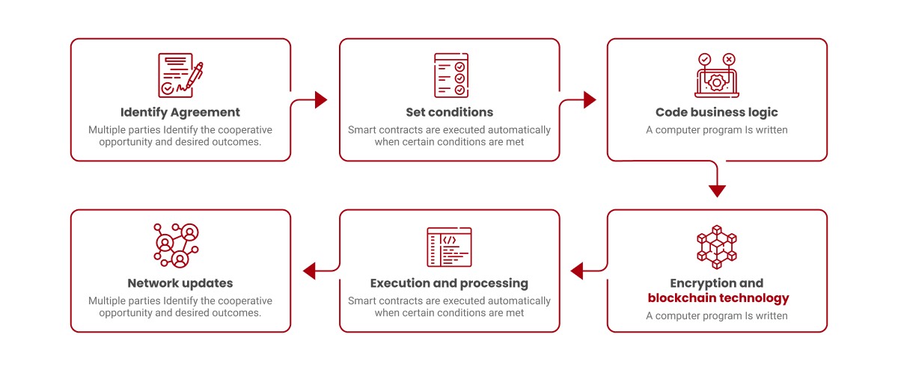

# 8️⃣ 블록체인 네트워크

블록체인은 암호화된 거래정보(Transaction)들을 블록 단위로 구성하여 서로 연결한 분산형 디지털 원장 기술이며, 별도의 중개 기관 없이도 신뢰를 보장하고 안전한 거래를 보장할 수 있는 특징을 갖는 기반 기술이다. 블록체인 인프라는 플랫폼 유저 및 사업자 간의 투명한 가치 교환을 보장하고, 콘텐츠 및 상품의 거래와 유통, 평가 보상 과정에서 사용되는 토큰을 발행하고 국내외 거래소와 교환할 수 있는 기반을 제공한다.&#x20;

<figure><figcaption>
<strong>Figure24. Technical Architecture of Blockchain Infrastructure</strong>
</figcaption></figure>

## 1. Polygon

Polygon는 다양한 Web3 도구와 분산형 애플리케이션(DApps)을 제공하는 블록체인 네트워크이다. Polygon는 스마트 컨트랙트를 지원하는 고성능 블록체인으로, 개발자들이 블록체인 게임, 거버넌스 및 투표 시스템, 분산형 금융) 등 모든 유형의 서비스와 애플리케이션을 만들 수 있는 환경을 지원한다. Polygon는 비콘체인(Beacon chain)(초기 버전의 MATIC 체인)의 한계를 해결하기 위해 만들어졌다. Polygon의 설계 목표는 MATIC 비콘체인의 작업에 방해가 되지 않으면서 MATIC 생태계에 스마트 계약을 도입하는 것이다. 따라서 Polygon는 MATIC 비콘체인과 달리, 스마트 컨트랙트 기능과 이더리움 가상 머신Ethereum Virtual Machin, EVM) 간의 호환성이 높다.

<figure><figcaption>
<strong>Figure25.</strong> Polygon PoS and Polygon zkEVM Cross-Chain Interaction Model
</figcaption></figure>

### (1) Polygon프로토콜의 작동 방식

Polygon는 위임지분증명(Delegated Proof of Stake, DPoS)과 권한증명(Proof-of-Authority, PoA) 합의 메커니즘이 결합된 형태인 지분권한증명(Proof-of-Staked-Authority, PoSA) 합의 알고리즘을 사용한다. 이를 통해 POL 비콘체인에 프로그래밍 가능성과 상호 운용성을 제공한다. 검증자들은 그들이 검증한 트랜잭션의 블록에서 발생하는 거래 수수료로 인센티브를 받는다.

PoSA는 자신이 보유한 토큰의 수를 기반으로 선출된 검증자들(Validator)의 시스템을 사용한다. 이들은 번갈아 가며 거래를 검증하고 이를 새로운 블록의 체인에 추가한다. 검증자를 오프라인 상태로 만드는 악성 공격이 발생할 경우, “후보자(Candidate)”라고 불리는 백업 검증자들이 보안을 책임진다. 이들은 비콘체인에 상황을 보고하고, Polygon에서 처리를 재개하고, 활성 검증자의 재선출을 제안할 수 있다.

### (2) Polygon의 특징

Polygon는 스마트 컨트랙트 기능을 제공하기 위해 만들어졌다. ERC-20 토큰 표준을 채택하며, 탈중앙화 어플리케이션(DApps), 디파이(DeFi) 서비스, 멀티 체인 지원, 그리고 기타 Web3 애플리케이션과 함께 EVM과 호환되는 계층으로 작동한다. 본질적으로, POL 비콘체인과 Polygon 블록체인은 나란히 운영된다. Polygon는 소위 말하는 레이어 2 또는 오프 체인 확장성 솔루션이 아니다. Polygon는 EVM과 호환되므로 이더리움 도구와 DApps을 지원하므로 개발자가 이더리움에서 Polygon로 프로젝트를 쉽게 이전할 수 있도록 지원하며, 유저에게는 MetaMask와 같은 애플리케이션을 Polygon와 쉽게 연동할 수 있도록 한다.

**• 짧은 블록 타임**

Polygon은 라이브 블록체인(메인넷)에서 최대 3초라는 짧은 블록 타임을 달성하고자 한다. 거래를 빠르게 처리할 수 있어 보다 빠른 확인이 가능하고, 잠재적인 지연을 줄일 수 있음을 의미한다.

**• 신속한 거래 확정**

Polygon은 거래를 신속하게 확정한다. 이는 한 번 거래가 블록에 포함되면 확정되어 되돌리거나 변경할 수 없다는 것을 의미한다. 이 기능은 Polygon 상 거래의 보안성과 신뢰성을 향상시킨다.

**• 비인플레이션(Non-inflationary) 모델**

Polygon는 네이티브 POL 토큰에 대해 비인플레이션 모델을 채택한다. 채굴을 통해 새로운 코인이 생성되는 기존의 인플레이션 모델과 달리, POL 블록의 보상은 거래 수수료에서 수집된다. 이 메커니즘은 시간이 지나도 안정적이고 예측 가능한 POL 공급을 유지할 수 있게 해준다.

**• 이더리움 가상 머신(Ethereum Virtual Machin, EVM) 호환성**

Polygon는 EVM과 완벽하게 호환된다. 이 호환성은 개발자들이 기존의 이더리움 기반 애플리케이션 및 스마트 계약을 신속하게 Polygon 생태계로 이전할 수 있게 한다. 또한 사용자에게 친숙한 환경과 다양한 디앱에 대한 액세스를 제공한다.

**• 지분증명 (Proof-of-Stake, PoS) 거버넌스**

Polygon는 지분증명 거버넌스 메커니즘을 사용한다. PoS는 POL 보유자들이 네트워크의 합의 및 의사 결정 과정에 참여할 수 있도록 한다. POL 토큰을 스테이킹함으로써, 보유자들은 블록 검증에 기여하고 네트워크 업그레이드 및 제안에 대한 투표에 참여할 수 있다.

### (3) POL 코인

POL는 Polygon 생태계의 네이티브 유틸리티 토큰이다. 거래소와 POL 비콘체인에서의 거래 수수료 지불, 스테이킹, 자산 이전에 사용되며, Polygon에서 스마트 컨트랙트를 실행하는 데에도 사용된다. Polygon의 블록체인 트랜잭션에서 지불하게 되는 가스 수수료는 POL로 지불할 수 있다.

이더리움 블록체인의 ETH와 마찬가지로, Polygon의 가스 수수료는 검증자들에게 트랜잭션을 확인하고 네트워크를 보호할 인센티브를 제공한다. POL를 추가적으로 획득하거나 네트워크 보안에 기여하고자 하는 POL 보유자는 스마트 컨트랙트에 POL를 스테이킹할 수 있다. 또한 Polygon 검증자에게 지분을 위임하여 블록 보상의 일부를 얻을 수 있다. 검증자는 가스 수수료로 수집한 POL 중 얼마를 위임자(delegator)에게 재분배할지 결정할 수 있다.

## 2. 스마트 컨트랙트

Polygon은 스마트 컨트랙트를 통해 새로운 기능과 더 많은 맞춤 설정을 도입하고, 분산형 애플리케이션(DApp)과 Web3 서비스의 폭발적인 성장을 촉진했다. 스마트 컨트랙트는 블록체인을 통해 실행되는 애플리케이션(프로그램)이며, 특정 조건이 충족되면 해당 작업(계약 내용)을 실행한다. 스마트 컨트랙트를 이용하면 제3자가 나서서 중개할 필요성이 없어져 운영비용을 크게 절감시킬 수 있다.&#x20;

<figure><figcaption>
<strong>Figure26. Example of how smart contracts work</strong>
</figcaption></figure>

Polygon의 스마트 컨트랙트는 컨트랙트 코드와 2개의 공개 키(Public Key)로 구성된다. 첫 번째 공개 키는 컨트랙트 작성자가 제공하는 키이고, 다른 하나는 컨트랙트 자체를 나타내며, 스마트 컨트랙트마다 고유한 디지털 식별자 역할을 한다. 모든 스마트 컨트랙트는 블록체인 거래를 통해 구축되며 EOA 또는 다른 스마트 컨트랙트가 호출해야 활성화 될 수 있다. 그러나 첫 번째 트리거(trigger)는 항상 EOA(유저)에 의해 발생한다.&#x20;

<figure><figcaption>
Figure27. Smart Contract Working on the BSC Network
</figcaption></figure>

Polygon 네트워크의 스마트 컨트랙트는 다음과 같은 기능이 있다.

**• 신뢰와 투명성(Trust and Transparency)**

스마트 컨트랙트에 계약 내용이 기록되면, 당사자 중 누구도 개인적 이익을 얻기 위해 계약 조건을 변경할 수 없다. 또한 당사자는 모든 조건을 볼 수 있으므로 모든 사람이 계약의 실행을 추적하고 거래에 대한 정보를 검토할 수 있다.

**• 보안(Security)**

스마트 컨트랙트 상의 각각의 기록은 선행 기록과 후행 기록에 연결되어 있다. 즉, 해커는 장부상의 하나의 기록을 바꾸기 위해 체인 전체를 재구성해야 한다. 또한 스마트 컨트랙트의 기록은 누구나 접근할 수 있지만 당사자의 익명성은 유지된다. 그러나 당사자의 이름과 기타 사적인 세부 사항은 공개되지 않는다.

**• 자동화(Automation)**

보통의 계약서는 일방 또는 쌍방이 계약의 특정 측면을 무시하거나, 다른 방식으로 계약을 이행하거나 혹은 계약을 이행하지 않을 수도 있다. 그러나 스마트 컨트랙트에서는 그런 일이 불가능하다. 바로 자동화 기능 때문이다. 스마트 컨트랙트의 모든 작업이 기계적으로 완료되기 때문에 어떤 형태의 중개자가 필요 없다. 또한 모든 것을 소프트웨어로 처리하기 때문에 데이터를 조작하거나 계약의 일부를 준수하지 않는 경우는 생기지 않는다.

**• 비용 절감(Reduced Expenses)**

스마트 컨트랙트의 모든 거래 당사자는 모든 거래를 완벽하게 확인할 수 있으며, 복잡한 결제를 수행하고 모니터링 하기 위한 그 어떤 중개인도 필요 없다. 대신 누구나 실시간으로 모든 운영을 효율화할 수 있으므로 지불해야 할 수수료와 요금이 부과되지 않는다.

**• 정확성, 효율성 및 민첩성(Accuracy, Efficiency, and Agility)**

스마트 컨트랙트의 자동화 기능은 계약 실행을 위한 모든 단계의 속도를 높이는 효과를 가져온다. 프로그래밍은 계약의 이행을 보장하는 동시에 정확성을 확보한다. 계약을 이행하기 위한 전제 조건이 충족되면 필요한 작업이 곧바로 수행되며, 이는 어떤 계약이든 항상 동일하게 적용된다.

