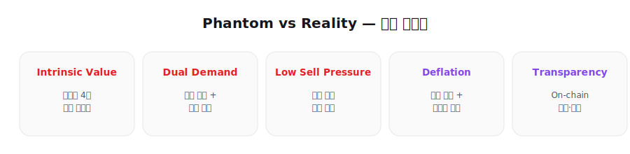

# 8. 경쟁력 및 지속가능성 (Core Competitiveness)

<figure><figcaption></figcaption></figure>

**"Phantom vs Reality"**

다수의 Web3 프로젝트가 실체 없는 내러티브와 기대감에 의존하는 반면, 레드힐은 이미 상용화된 실전 서비스와 반복 매출 구조를 갖춘 프로젝트입니다.

## 8.1 Intrinsic Value (내재 가치)

레드힐은 이미 시장에서 운영된 4개의 핵심 서비스를 보유하고 있으며, 이는 REDH 토큰의 실질 수요 기반이 됩니다.

## 8.2 Dual Demand Engine (이중 수요 구조)

REDH는 단순 보유형이 아니라, 코인 서비스 이용을 위한 **보유 수요**와 주식 서비스 이용을 위한 **결제 수요**를 동시에 형성합니다.

## 8.3 Low Selling Pressure (매도 압력 완화)

코인 자동매매 서비스 이용을 위해 토큰 보유가 필요하므로, 장기 보유 유인이 자연스럽게 강화됩니다.

## 8.4 Recurring Revenue & Deflation (반복 매출과 디플레이션)

주식 월결제 서비스는 반복 매출을 창출하고, 기업 실매출은 바이백 및 소각의 재원이 되어 REDH 가치 구조를 지지합니다.

## 8.5 Transparency (투명성)

On-chain 기반 인증 및 서비스 권한 검증을 통해, 멤버십 운영의 투명성과 신뢰성을 유지합니다.
