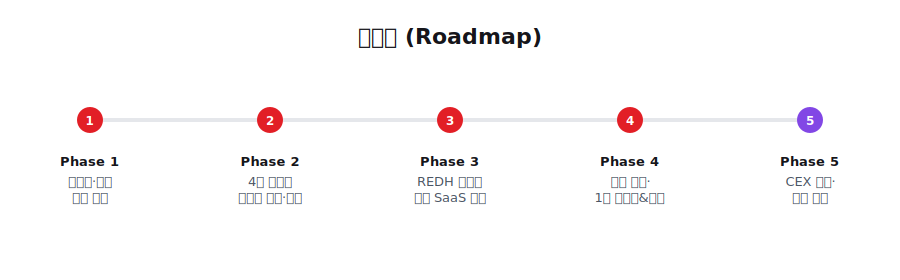

# 9. 로드맵 (Roadmap)

<figure><figcaption></figcaption></figure>

## Phase 1
멤버십 아키텍처 설계 및 Web3 지갑 인증 모듈 개발 완료

## Phase 2
레거시 서비스 4종과 블록체인 기반 보유형 멤버십 연동 및 플랫폼 런칭

## Phase 3
주식 관련 서비스의 REDH 월결제 모듈 도입 및 구독형 SaaS 구조 정착

## Phase 4
오토 트레이딩 유저 베이스 확장 및 1차 분기 바이백 & 소각 실행

## Phase 5
글로벌 거래소(CEX) 상장 및 해외 자동매매 시장 진출
